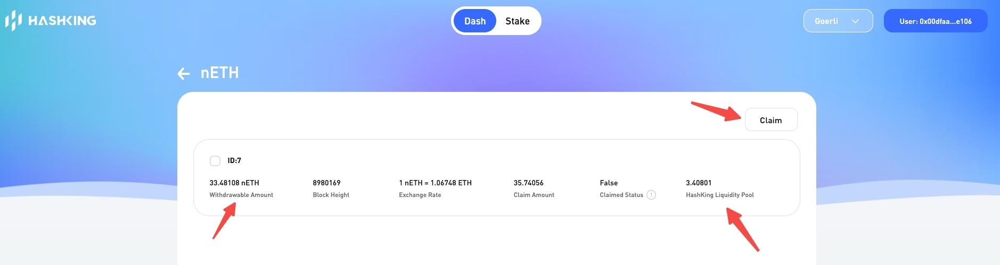

# nETH large Request exitscan 步骤

1、**扫描链上需要退出的nETH largeRequestId 列表**。可通过withdrawalRequest合约`getWithdrawalOfRequestId`方法。

此过程筛选的largeRequestId，还需要进一步过滤，因为异步退出的Validator的状态可能还没有同步到链上。

2、 **在链上获取Operator nETH对应vNFT的记录**。

**nETH对应的vNFT所有者为LiquidStaking，nETH largeRequest 退出的validator必须是 LiquidStaking所拥有的。**

> vNFT方式的记录，所有者为用户。

3、**Operator自行实现过滤withdrawalRequest列表。**

4、**Operator自行实现已发起退出的Validator过滤**。

Validator的退出需要经过beacon的生命周期，退出是异步的，退出完成时间并不确定。发起退出的Validator在Oracle没有上报触发结算，链上数据是并不会更新。因此需要链下的手段来进行过滤。

不同Operator可能存在不同的技术实现，我们提供一种最简单示例用以参考，使用MySQL来实现过滤。

5、**根据过滤后的withdrawalRequest列表计算退出多少个Validator**。

6、**退出Validator并在数据库中进行标记**。

7、**标记过滤后的withdrawalRequest列表为已处理**。


# 具体实现

## 1、扫描链上需要退出的nETH largeRequestId 列表

实现参看：[validator/exitscan/neth_large_request.go](../../validator/exitscan/neth_large_request.go)

方法：`WithdrawalRequestScan`

此方法会扫描链上需要处理WithdrawalRequest，还需要进行去链下过滤。

> 这部分直接调用智能合约，Operator通用。


## 2、在链上获取Operator nETH对应vNFT的记录

实现参看：[validator/exitscan/neth_large_request.go](../../validator/exitscan/neth_large_request.go)

方法：`ExitScan`

此方法会扫描链上未退出并且所有者是LiquidStaking的vNFT记录，还需要进行去链下过滤。

> 这部分直接调用智能合约，Operator通用。

## 3、Operator自行实现过滤withdrawalRequest列表

> 此部分示例 这里借助MySQL实现，Operator可以根据具体情况进行实现。

示例参看：[example/exitscan/dbscan/exit_filter.go](../../example/exitscan/dbscan/exit_filter.go)

方法：`WithdrawalRequestFilter`

在示例中，根据 `filterWithdrawalRequests` 已过滤的列表，计算需要退出Validator的数量。

代码参看 `WithdrawalRequestExitValidatorCounter` 的实现：

```go
// WithdrawalRequestExitValidatorCounter Calculate the number of validators that need to be exited by a Withdrawal Request
type WithdrawalRequestExitValidatorCounter interface {
	// ExitCounter Calculate the number of validators that need to be exited by a Withdrawal Request
	// @param filterWithdrawalRequests  A list of offline filtered Withdrawal Requests
	ExitCounter(filterWithdrawalRequests []*WithdrawalRequest) (uint32, error)
}
```


另外，要实现 `WithdrawalRequestFilter` 的链下过滤，那么就要有方式去在链下存储扫描到的 `WithdrawalRequest` 记录。 这一部分示例中也会在 `WithdrawalRequestFilter` 实现。

> Validator(vNFT) 记录会在 registerValidator 部分中将记录存储在示例的数据库中。


## 4、Operator自行实现已发起退出的Validator过滤

> 此部分示例 这里借助MySQL实现，Operator可以根据具体情况进行实现。
>
> 在过滤退出的Validator前，Validator应当已经在数据库表 `nodedao_validator` 中存在。可以再 `registerValidator`后将其存储到库中，这部分会在 `registerValidator` 操作里说明。现在可以假设 Validator 已经在表 `nodedao_validator` 中。

示例参看：[example/exitscan/dbscan/exit_filter.go](../../example/exitscan/dbscan/exit_filter.go)

方法：`WithdrawalRequestFilter`

方法：`Filter`

`NETHExitScan.ExitScan` 在链上扫描的记录 `vnftRecords` ，作为 `Filter` 的入参 `vnftContractExitRecords`。


## 5、根据过滤后的withdrawalRequest列表计算退出多少个Validator

实现参看：[validator/exitscan/neth_large_request.go](../../validator/exitscan/neth_large_request.go)

方法：`ExitCounter`

> if sumETHAmount = 64 ether, need to exit 2 validator
> if sumETHAmount = 66 ether, need to exit 3 validator


## 6、退出Validator并在数据库中进行标记

> 此部分示例 这里借助MySQL实现，Operator可以根据具体情况进行实现。

第二步中过滤后的Validators即是Operator需要退出的，**Operator需要根据自己的技术实现去发起Validator的退出**。 并标记这些Validator已经发起退出，用于下一次的 `Filter`。

示例参看：[example/exitscan/dbscan/exit_mark.go](../../example/exitscan/dbscan/exit_mark.go) 

方法：`ExitMark`


## 7、标记过滤后的withdrawalRequest列表为已处理

> 此部分示例 这里借助MySQL实现，Operator可以根据具体情况进行实现。

标记这些withdrawalRequest已经处理，用于下一次的 `Filter`。

示例参看：[example/exitscan/dbscan/exit_mark.go](../../example/exitscan/dbscan/exit_mark.go) 

方法：`WithdrawalRequestMark`


## 实现流程示例

代码参看：[example/exitscan/dbscan/neth_exit_scan_example.go](../../example/exitscan/dbscan/neth_exit_scan_example.go)

方法：``NethExitScanByDB_Example`

> 在第6步的代码中，需要退出筛选过的Validator，这部分Operator需要根据自己的技术栈进行实现。


## 定时任务 周期性执行

上述三个步骤应当在 **定时任务** 中周期执行，有用户发起 unstake，Operator应当及时退出Validator。

定时任务调用的方法参看：代码参看：[example/exitscan/dbscan/vnft_exit_scan_example.go](../../example/exitscan/dbscan/vnft_exit_scan_example.go)

方法：`CornNethExitScanByDB_Example`

> 定时任务实现：略


# 用户 claim withdrawRequest

当operator 针对withdrawRequest退出validator，并且Oracle上报触发结算后，ETH会回到 Operator Liquidity Pool。

用户还需要进行 Claim，ETH才会会到提款账户。Claim前提条件为：`Withdraw Amount <= Operator Liquidity Pool`。




